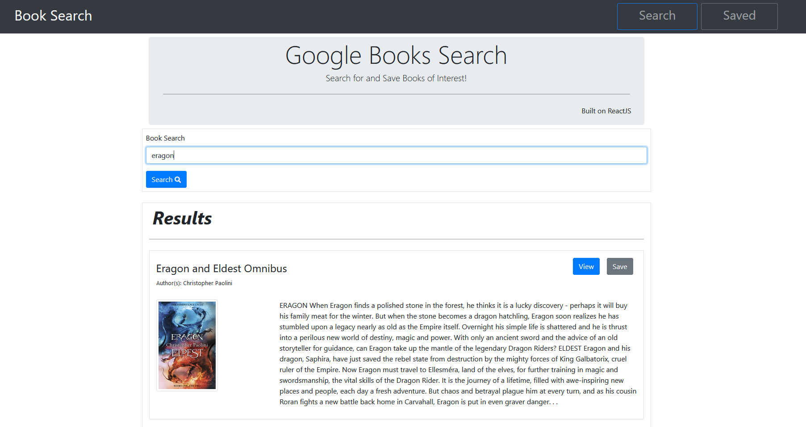

# Google Books Search and Save
 
  
 
  
A full-stack application build on React using Express, MongoDB and NodeJS and powered by Heroku. Users can search for books via the Google Books API, Save them to a Mongo Database, and Remove saved books from their list.

---

## Table of Contents

* [Installation](#Installation)  
* [Contribution](#Contribution)  
* [User Story](#User-Story)  
* [Link to Deployed Application](#Link-to-Deployed-Application)  
* [Example](#Example)  
* [Contents](#Contents)  
* [Team](#Author)  
* [License](#License)  
* [Credits](#Credits)  
  
 ---
 
 
## Installation

Feel free to [clone the repo](https://github.com/abraspin/google-books-search) and run locally by using the terminal/bash command `npm  start`

## Contribution

Please contact me if you find an issue or have a suggestion for future development!
 
## User Story

>As an avid reader  
>I want to be able to search the google books repository  
>So that I can keep track of specific books I've saved  

---

## Link to Deployed Application

Just visit [the GitHub Pages deployed app](https://abraspin.github.io/google-books-search/) to begin!  

Search for a keyword and save any books you like, and view and remove your saved books from the "Saved" page.

---

## Example

---

## Author
[Abraham Spindel](https://github.com/abraspin)

---

## License

---

## Credits
* NodeJS Project [MIT license](https://raw.githubusercontent.com/nodejs/node/master/LICENSE)   
* Node Package Manager (npm) [Artistic License 2.0](https://www.npmjs.com/policies/npm-license)  

